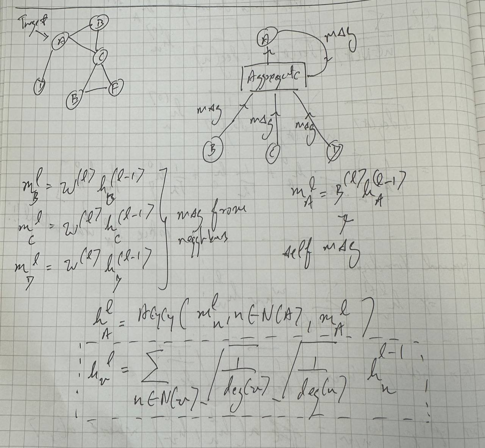
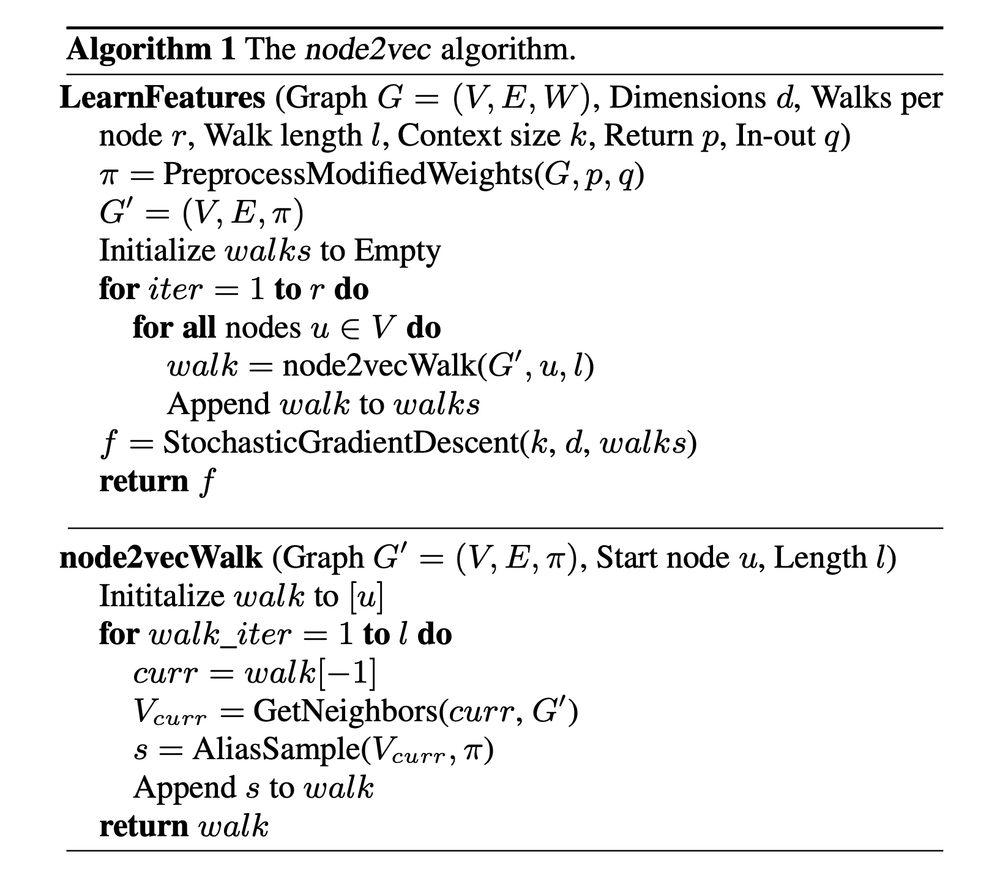
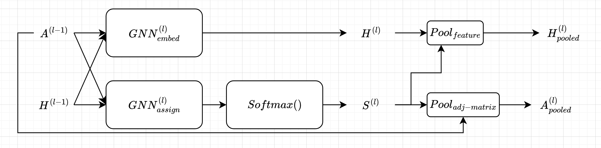

# Graph Neural Networks 

## Table of Contents 
- [GCN](#graph-convolutional-network)
- [GAT](#graph-attention-network)
- [Node2Vec](#node2vec)
- [DiffPool](#diffpool)
- [DeepWalk](#deepwalk)

## Graph Convolutional Network
### Overview
A standard convolution in Deep Learnin such as in Convolutional Neural
Networks applies a filter to a signal (image). However in discrete 
graph structures, there is no natural grid-like structure 
like in images, so we need a different way to define convolutions.

A spectral convolution on a graph is a mathematical way to filter 
a signal defined on a graph using the eigenvalues and eigenvectors 
of a special matrix called the graph Laplacian.


### Message and Aggregate View

<p align="center">
  
</p>


$$
h_{v}^{(l)} = \sigma(\Sigma_{u \in N(v)}W^{(l)}\frac{1}{\sqrt{|N(u)||N(v)|}}h_{u}^{l-1})
$$

where: 

- $h_v^{(l)}$ is the node feature representation of node $v$ at layer $l$.
- $N(v)$ represents the **neighbors** of node $v$.
- $W^{(l)}$ is the trainable weight matrix at layer $l$.
- $\frac{1}{\sqrt{|N(u)| |N(v)|}}$ is a **normalization term** that accounts for the degree of nodes.
- $h_u^{(l-1)}$ represents the feature vector of neighboring node $u$ from the previous layer $l - 1$.
- $\sigma(\cdot)$ is a **non-linear activation function** (e.g., ReLU).

Is $v$ part of $N(v)$ : for this paper, yes since there are self loops, $\tilde{A} = A + I$


### GCN Propagation Rule

$$
H^{(l+1)} = \sigma \left( \tilde{D}^{- \frac{1}{2}} \tilde{A} \tilde{D}^{- \frac{1}{2}} H^{(l)} W^{(l)} \right)
$$

where:
- $\tilde{A} = A + I_N$ is the adjacency matrix of the undirected graph $\mathcal{G}$ with added self-connections.
- $I_N$ is the identity matrix.
- $\tilde{D_{ii}} = \sum_j \tilde{A}_{ij}$ is the degree matrix corresponding to $\tilde{A}$.
- $W^{(l)}$ is a layer-specific trainable weight matrix.
- $\sigma(\cdot)$ denotes an activation function, such as ReLU: $\text{ReLU}(x) = \max(0, x)$.
- $H^{(0)} = X$ is the input feature matrix of shape $\mathbb{R}^{N \times D}$.


### Code Sample
```python
print('test')
```
---
## Graph Attention Network

### Overview
Graph Neural Networks (GNNs) typically follow a **message passing** framework, consisting of two main steps at each layer:

1. **Message**: Each node collects information (messages) from its neighbors.  
2. **Aggregate**: These messages are aggregated (e.g., by summation or averaging), usually followed by a non-linear transformation.


### GNN Layer Formula

At layer $l$, the updated node representation for node $v$ is given by:

$$
h_{v}^{l} = \sigma\left(\sum_{u \in N(v)} \alpha_{u,v}^{l} W^{l} h_{u}^{l-1}\right)
$$

- $h_v^l$: Node feature of node $v$ at layer $l$  
- $N(v)$: Set of neighbors of node $v$  
- $\sigma$: Non-linear activation function (e.g., ReLU)


### Attention Coefficient: $\alpha_{u,v}^l$

The key difference between **GCNs** and **GATs** lies in how $\alpha_{u,v}^l$ is computed.

**GCN (Graph Convolutional Network)**

$$
\alpha_{u,v}^{l} = \frac{1}{\sqrt{|N(u)| |N(v)|}}
$$

This uses fixed, normalized weights for neighboring nodes.

**GAT (Graph Attention Network)**

$$
\alpha_{u,v}^{l} = \text{Softmax}_u\left(a(h_u^l, h_v^l)\right)
$$

Where the attention score function $a$ is defined as:

$$
a(h_u^l, h_v^l) = \text{LeakyReLU}\left(\psi^\top [W'^l h_u^{l-1} \,||\, W^l h_v^{l-1}]\right)
$$

- $\psi \in \mathbb{R}^{F}$: Learnable attention vector  
- $W^l$, $W'^l$: Learnable weight matrices at layer $l$  
- $||$: Concatenation operator  
- $\text{LeakyReLU}$: Non-linear activation function to allow negative values

The **Softmax** ensures that attention coefficients for each node’s neighbors sum to 1.

### Code Sample
```python
print('test')
```


## Node2Vec
### Overview 
Node2vec is an algorithm we can use to find a feature vector representation of each node in a graph. Node2Vec is a transductive method, meaning that it learns embeddings specifically for the nodes present in the training graph and does not generalize to unseen nodes or graphs without retraining. To dumb it down, if new nodes are introduced later, Node2Vec won't be able to provide embeddings for them unless the model is retrained on the expanded graph.

### How the node embeddings are learned
**Step 1: Generate 2nd order biased random walks to sample node neighborhoods** </br>

By sampling a node's neighbors, we are able to capture the local structure of the graph relative to a node. This local context is similar to how surrounding words provide context in language models. We could consider every single neighbor or path but this is extremtly computationally expensive. Sampling a subset of the neighborhood makes the process more efficient while still preserving the essential structural information. 

Node2Vec performs multiple random walks starting from each node. Unlike a simple random walk, these walks are biased using two parameters:
- $p$ (Return Parameter): Controls the likelihood revisiting previous node, thus tuning the probability of a walk "backtracking".
- $q$ (In-Out Parameter): Regulates whether the walk is more exploratory (moving further away from the source node) or more localized (staying close the source node). 


We set the unnormalized transitional probabilities as $\pi_{vx} = \alpha_{pq}(t,x) * w_{vx}$ where 
- $w_{vx}$: weight of the edge $(v,x)$
- $\alpha_{p,q}(t,x)$: bias factor


$$
\alpha_{p,q}(t, x) = 
\begin{cases}
\frac{1}{p}, & \text{if } d_{tx} = 0 \\
1,           & \text{if } d_{tx} = 1 \\
\frac{1}{q}, & \text{if } d_{tx} = 2
\end{cases}
$$

where 
- $t$: previous node in the walk
- $v$: current node in the walk 
- $x$: candidate neighbor of $v$ to move to text (t is one of the candidates)
- $d_{tx}$: shortest path between node $t$ and node $x$ in the graph.


**Step 2: Learning with the Skip-Gram Model**

Multiple random walks of fixed length was done from each node in the graph. Each random walk is treated as a "sentence" that captures the context in which nodes co-occur. All the random walks together form a corpus, much like sentences in text corpus. Each walk is like a sentence and each node is like a word. The skip-gram model is then trained on this corpus. For each node in a walk, its neighboring nodes (within a specific window) are treated as the context. The model learns embeddings by trying to predict the context nodes from the target node. Because nodes that appear together in walks tend to be structurally or functionally related, the skip-gram model produces embeddings that capture both local and global network structure.


Node2vec uses the skip-gram model objective, which is to maximize the probability of observing a node's neighbors given its embeddings. Mathematically for a node $u$ with context nodes $N(u)$, the objective is: 

$$
\max_{\Phi} \sum_{u \in V} \log \Pr\bigl(N(u) \mid \Phi(u)\bigr)
$$

where: 
- $\Phi(u)$ is the embedding of node $u$.
- $ \Pr\bigl(N(u) \mid \Phi(u)\bigr)$ is modelled using softmax function over the dot products between embeddings.

Similar to Word2Vec, negative sampling was used to optimize this objective. The model learns to distinguish between actual context nodes (positive samples) and randomly sampled nodes (negative samples).


### Node2Vec Algorithm

<p align="center">
  
</p>

### Code Sample
```python
print('test')
```


## DiffPool
DiffPool (Differentiable Pooling) is a hierarchical graph neural network (GNN) method that learns to cluster nodes dynamically and creates coarser representations of a graph. Unlike traditional GNNs that operate at a fixed scale, DiffPool automatically learns hierarchical structures by clustering nodes in a differentiable manner.

### Overview
In many graph tasks, especially graph-level classification, we want to capture multi-scale or hierarchical properties of the graph. DiffPool addresses this by stacking multiple GNN "pooling" layers. Each pooling layer:
1. Generate Node Embeddings: A GNN encoder produces updated node features.
2. Predicts Cluster Assignments: A GNN assignment module produces a soft cluster assignment matrix.
3. Pools the Graph: Using these assignments, the nodes (and their features) are aggregated into a smaller set of "super-nodes", creating a coarser graph representation. 

This process can be repeated multiple times to form a hierarchy of increasingly coarse graphs, analogous to pooling operations in CNNs.


### DiffPool Layer
<p align="center">
  
</p>

**Inputs to Layer** $l$:

- **Adjacency** $\mathbf{A}^{(l-1)}$ (size $n^{(l-1)} \times n^{(l-1)}$):  
  The graph structure from the previous layer (or the original graph if $l=1$).

- **Node Features** $\mathbf{H}^{(l-1)}$ (size $n^{(l-1)} \times d^{(l-1)}$):  
  The node embeddings from the previous layer (or the initial features if $l=1$).

**GNN for Embedding** $\text{GNN}_{\text{embed}}^{(l)}$:

This GNN updates node embeddings using $\mathbf{A}^{(l-1)}$ and $\mathbf{H}^{(l-1)}$. The output is

$$
\mathbf{H}^{(l)} = \text{GNN}_{\text{embed}}^{(l)}(\mathbf{A}^{(l-1)}, \mathbf{H}^{(l-1)}).
$$

Here, $\mathbf{H}^{(l)}$ is the new feature matrix of size $n^{(l-1)} \times d^{(l)}$.

**GNN for Assignment** $\text{GNN}_{\text{assign}}^{(l)}$:

In parallel, another GNN learns a cluster assignment matrix $\mathbf{S}^{(l)}$, given by

$$
\mathbf{S}^{(l)} = \text{Softmax}\bigl(\text{GNN}_{\text{assign}}^{(l)}(\mathbf{A}^{(l-1)}, \mathbf{H}^{(l-1)})\bigr),
$$

where $\mathbf{S}^{(l)}$ has size $n^{(l-1)} \times n^{(l)}$. Each row corresponds to a node, and each column corresponds to one of the $n^{(l)}$ clusters at layer $l$. The softmax ensures that each row is a valid probability distribution.

**Pooling (Feature & Adjacency)**:

- **Feature Pooling**:

$$
\mathbf{H}_{\text{pooled}}^{(l)} = \mathbf{S}^{(l)\top}\,\mathbf{H}^{(l)},
$$

which aggregates the node embeddings into $n^{(l)}$ “super-nodes.”

- **Adjacency Pooling**:

$$
\mathbf{A}^{(l)}_{pooled} = \mathbf{S}^{(l)\top}\,\mathbf{A}^{(l-1)}\,\mathbf{S}^{(l)},
$$

  forming the new adjacency matrix among the $n^{(l)}$ clusters.

**Outputs of Layer** $l$:

- **Coarser Graph**: $(\mathbf{A}^{(l)},\,\mathbf{H}_{\text{pooled}}^{(l)})$
- **Cluster Assignments**: $\mathbf{S}^{(l)}$


### Training DiffPool
DiffPool is trained end-to-end using a combination of three loss functions:
1. Classfication loss 
2. Link reconstruction loss 
3. Entropy regularization loss

**Classifcation Loss**

This loss, denoted as $\mathcal{L}_{\text{class}}$, is computed on the final graph representation for tasks such as graph classification. For example, if you use cross-entropy loss for classification, it is given by

$$
\mathcal{L}_{\text{class}} = -\sum_{i=1}^{C} y_i \log(\hat{y}_i),
$$

where $y_i$ is the ground truth label (often one-hot encoded) for class $i$, and $\hat{y}_i$ is the predicted probability for that class.

**Link Reconstruction Loss**

The link reconstruction loss, $\mathcal{L}_{\text{link}}$, encourages the pooling operation to preserve the graph's connectivity. One common formulation is to compare the original adjacency matrix with the one reconstructed from the soft assignments. For instance:

The link reconstruction loss, often denoted $\mathcal{L}_{\text{link}}$, encourages the pooling operation to preserve the graph’s connectivity. Two common formulations appear in the literature:

1. **Direct Reconstruction**:

 $$
 \mathcal{L}_{\text{link}} 
 = \bigl\| \mathbf{A}^{(l-1)} \;-\; \mathbf{S}^{(l)}\,(\mathbf{S}^{(l)})^\top \bigr\|_F^2,
 $$

   where $\mathbf{A}^{(l-1)}$ is the adjacency matrix at layer $l-1$, and $\mathbf{S}^{(l)}$ is the soft cluster assignment matrix at layer $l$. The norm $\|\cdot\|_F^2$ denotes the squared Frobenius norm.

2. **Adjacency-Inclusive Reconstruction**:

 $$
 \mathcal{L}_{\text{link}} 
 = \bigl\| \mathbf{A}^{(l-1)} \;-\; \mathbf{S}^{(l)}\,(\mathbf{S}^{(l)})^\top \,\mathbf{A}^{(l-1)} \bigr\|_F^2.
 $$

### Code Sample
```python
print('test')
```


