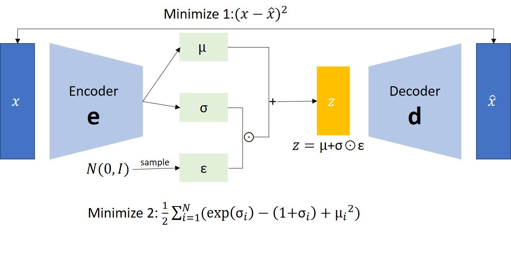

# Varational Auto Encoders

## Table of Contents
- [VAE](#vae)

## VAE
This is an implementation of the original VAE paper. The architecture consists of two parts:
1. Encoder
2. Decoder 

  

### Encoder
The Encoder is a neural network that models the approximate posterior distribution, $q_\theta(z|x)$ which which serves as an approximation to the true posterior $P(z|x)$.Instead of learning a deterministic mapping like in regular Autoencoders, the encoder in the VAE learns the parameters of a Gaussian distribution in the latent space. 

Encoder outputs 
1. $\mu_{\theta}$ (mean vector)
    - A vector representing the center of the latent distribution for each sample 
2. $log{\Sigma_{\theta}}$ (log-variance vector )
    - Instead of learning the variance $\Sigma_{\theta}$, we learns its logarithm for numerical stability. 

Thus we can say that the encoder transfromer an image, $x$ into these two vectors, $\mu_\theta(x)$, $log\Sigma_\theta(x)$. These parameters define the Gaussian distribution $q_\theta(z|x) = N(\mu_\theta(x), log\Sigma_\theta(x))$. 

### Latent Sampling with Reparameterization Trick 
Instead of sampling directly from $q_\theta(z|x)$, which is non-differentiable (backprop issues), we use the reparameterization trick:

$$
z = \mu_\theta(x)+\epsilon \sigma_\theta(x)
$$
where $\epsilon \sim N(0,I)$

### Decoder 
The Decoder is a neural network that reconstructs an image from a latent variable, $z$. It models the conditional likelihood, $P_\phi(x|z)$.

Decoder output: 
The decoder defines a distribution over images given $z$, usually modelled as a Bernoulli or Gasussian distribution. 
1. For binary images: $P_\phi(x|z)$ is Bernoulli, and the output is passed through a sigmoid function.
2. For continuous images: $P_\phi(x|z)$ is Gaussian, the decode learning both $\mu$ and $\sigma$. 

### Loss Function
The **VAE loss** consists of two terms:
1. **Reconstruction Loss** – Measures how well the generated image $ \hat{x}$ matches the original input $x$.
2. **KL Divergence Loss** – Ensures the latent space follows a **normal distribution**.

$$
\mathcal{L}(\theta, \phi) = \mathbb{E}_{q_\phi(z|x)} [\log p_\theta(x|z)] - D_{KL} (q_\phi(z|x) || p(z))
$$
where:

- $p_{\theta}(x | z)$ is the **decoder likelihood** (Gaussian or Bernoulli).
- $q_{\phi}(z | x)$ is the **approximate posterior** modeled by the encoder.
- $p(z)$ is the **prior**, typically a standard normal $\mathcal{N}(0, I)$.

### Mean Squared Error (MSE) Reconstruction Loss
For **continuous images**, we assume a **Gaussian likelihood**:

$
p_{\theta}(x | z) = \mathcal{N}(\hat{x}, I)
$

which leads to the **MSE-based reconstruction loss**:

$$
\mathcal{L}_{\text{recon}} = \frac{1}{2} || x - \hat{x} ||^2
$$

### KL Divergence Loss

The **KL divergence** regularizes the latent space by ensuring that $ q_{\phi}(z|x)$ remains close to the prior:

$$
p(z) = \mathcal{N}(0, I)
$$

$$
D_{KL}(q_{\phi}(z|x) || p(z)) = \frac{1}{2} \sum_{i=1}^{d} \Big( 1 + \log \Sigma_{\theta,i}^2 - \mu_{\theta,i}^2 - \Sigma_{\theta,i}^2 \Big)
$$